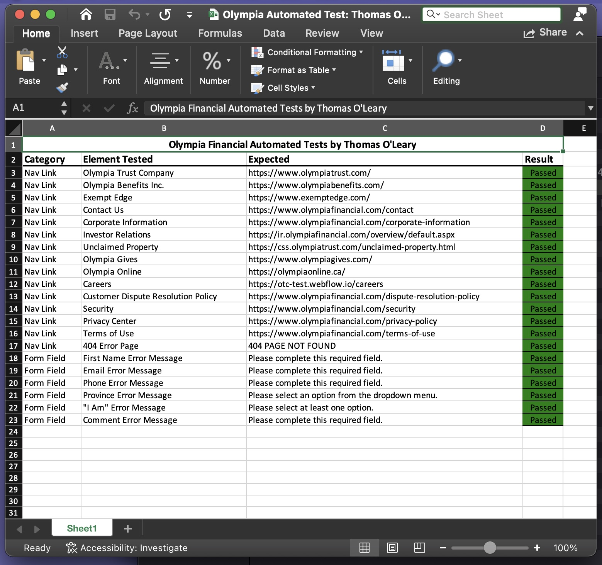

I have taken the liberty of writing some very basic tests of your website’s publicly facing frontend.
In the interest of time I used a combination of Python/Selenium. I have only separated the helper
functions, paths and constants while combining the tests to reduce the number of files in the
directory.

Test one checks navigation functionality in the dropdown menu located beside the Olympia logo. It
confirms that when each link is clicked it does in fact lead to the correct URL.

Test two confirms that required fields in the "Contact Us" form throw an error if submitted while
empty and that the error displayed is the correct message for that specific field.

Currently the results of the test are written to a XLSX file, which can be viewed in the README
file in my GitHub repository.

Thank you very much for your time,

Thomas O’Leary
All contact information is available on my resumé and cover letter.

Please see below an image of the XLSX output file for the tests.

